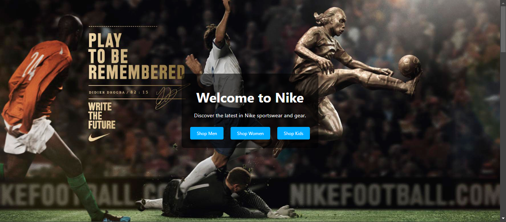
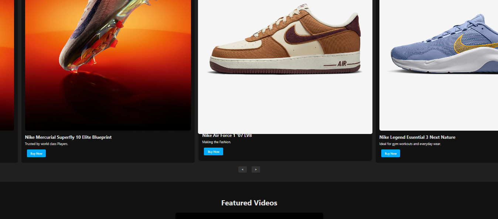

# PRODIGY_WD_01
# Landing Page

This is a simple Landing page of Nike built in consideration of actual products built with HTML, CSS, and JavaScript. This had a cta buttons for Men,Women and kids ,Also having a featured products section. Additionally, the footer contains social media links to facebook, Instagram, and X profiles.



## Table of Contents

- [Features](#features)
- [Installation](#installation)
- [Usage](#usage)
- [Project Structure](#project-structure)
- [Customization](#customization)
- [Contributing](#contributing)
- [License](#license)
- [Contact](#contact)

## Features

-  A Simple landing page for Nike website to buy and browse products.
- Also have a featured  products section with products Name and Photo With a hovering effect  .
- A Ad campaign video embedded.
- A carousel background for the hero section
- A carousel chnage inm products lineup
- Footer with social media links.

## Installation

1. Clone the repository:

   ```sh
   git clone https://github.com/Tanmay4409/PRODIGY_WD_01.git
   ```

2. Navigate to the project directory:

   ```sh
   cd PRODIGY_WD_01
   ```

3. Open the `index.html` file in your preferred web browser.

## Usage

1. Hover effect  on the featured products .
2. Can click on the buy now button

## Project Structure

```plaintext
PRODIGY_WD_01/
│
├── img/   
│   ├── facebook-icon.png
│   ├── hero.png
│   ├── hero2.png
│   ├── hero3.png
│   ├── instagram-icon.png
│   ├── product1.png
│   ├── product2.png
│   ├── product3.png
│   ├── product4.png
│   ├── product5.png
│   ├── product6.png
│   ├── product7.png
│   ├── product8.png
│   ├── product9.png
│   ├── product10.png
│   ├── product11.png
│   ├── product12.png
│   ├── product13.png
│   ├── product14.png
│   ├── product15.png
│   └──twitter-icon.png
│
├── License
├── screenshot.png
├── screenshot1.png
├── style.css
├── script.js
└── index.html
```

- `style.css`: Contains the styles for the project.
- `script.js`: Contains the JavaScript code for the stopwatch functionality.
- `index.html`: The main HTML file for the project.

## Customization

You can customize the project by modifying the HTML, CSS, and JavaScript files as needed.

- **HTML**: Update the `index.html` file to change the structure or content of the page.
- **CSS**: Update the `style.css` file to change the styles.
- **JavaScript**: Update the `script.js` file to change the functionality.

## Contributing

Contributions are welcome! Please feel free to submit a Pull Request or open an Issue if you have any suggestions or improvements.

## License

This project is licensed under the MIT License. See the [LICENSE](LICENSE)  for more details.

## Contact

- **LinkedIn**: [Tanmay Patil](https://www.linkedin.com/in/tanmay-patil-98b030258/)
- **Instagram**: [@t_nmaypatil](https://www.instagram.com/t_nmaypatil/?igsh=MXN2NGg0dGF4aXNkeA%3D%3D)
- **GitHub**: [Tanmay4409](https://github.com/Tanmay4409)

---

Feel free to update the README content as per your project requirements and preferences.
